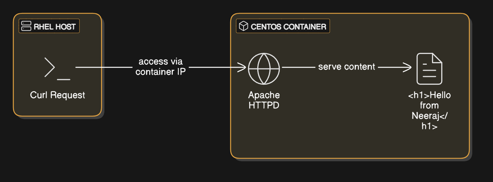

# centos-container-HTTPD
# Running a CentOS Container with Apache (HTTPD) inside RHEL

## **Project Overview**
This project demonstrates how to:
- Run a CentOS container inside RHEL.
- Install Apache (`httpd`) inside the container.
- Serve a simple webpage (`Hello from Neeraj`).
- Find the container's IP and access it using `curl`.

## **Steps to Reproduce**

### **1. Run a CentOS Container**
```bash
docker run -dit --name mycentos centos:latest
```
2. Install Apache (httpd) Inside the Container
```bash
docker exec -it mycentos yum install -y httpd
```
3. Add a Simple Webpage
```bash
docker exec -it mycentos bash -c "echo '<h1>Hello from Neeraj</h1>' > /var/www/html/index.html"
```
4. Start Apache Server
```bash
docker exec -it mycentos httpd
```
5. Get the IP Address of the Container
```bash

docker inspect -f '{{range.NetworkSettings.Networks}}{{.IPAddress}}{{end}}' mycentos
Example Output: 172.17.0.2
```
7. Test the Webpage from RHEL
```bash
curl 172.17.0.2
```
Expected Output:
```HTML
<h1>Hello from Neeraj</h1>
```
## **Project Screenshot**
Here’s the output of `curl` from RHEL after running the CentOS container:


